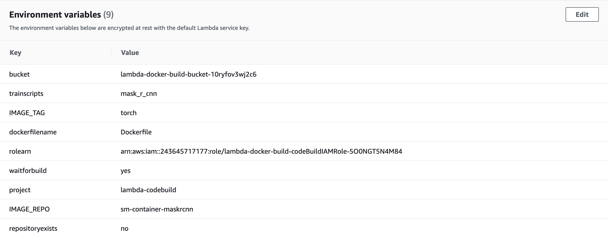

# Build, Train and Deploy your own Mask R-CNN container to Amazon SageMaker using AWS StepFunctions Data Science SDK. 


This workshop demonstrates how to use the StepFunction Data Science SDK to build train and deploy your own container in Amazon
SageMaker using only Python Code. This enables data scientists to develop Continuous Integration/Continuous Delivery (CI/CD) pipelines
into their workflow. 

The overall flow of this workshop is as follows:

1. Upload your code to the Lambda console
2. Use StepFunctions pipeline to kick off the Lambda function which in-turn will launch a CodeBuild job to build your Mask R-CNN Docker container with your custom code
3. CodeBuild will upload the Docker container to Amazon ECR for your use.
4. The StepFunctions Training pipeline will pick up this Docker container, train the model and deploy it.

**Caution** Note that in order to train a Mask R-CNN model, we use an ml.p3.2xlarge instance with a training time of roughly 320 seconds. 
This will incur a cost of $0.38 for training the model.


# Step 1: Deploy this CloudFormation template

This Cloudformation template creates a Lambda function with a sample Dockerfile that launches a Codebuild job
to build a Sagemaker specific container. 

Launch CloudFormation stack in *us-east-1*: [](https://console.aws.amazon.com/cloudformation/home?region=us-east-1#/stacks/create/template?stackName=lambda-docker-build&templateURL=https://lambda-ml-layers.s3.amazonaws.com/lambda-sm-build.yaml)

Cloudformation will fill in all the necessary details (stack name and parameters) so you should be able to just do *Next* until you get to "Review lambda-docker-build". Acknowledge that AWS CloudFormation will create IAM resources, and click "Create Stack".

After the creation is done, note the Outputs tab where you should find the LambdaFunctionARN, LambdaFunctionName and LambdaRoleARN. You'll need these later on in the lab.

SageMaker Containers gives you tools to create SageMaker-compatible Docker containers, and has additional tools for letting you create Frameworks (SageMaker-compatible Docker containers that can run arbitrary Python or shell scripts). 
Currently, this library is used by the following containers: TensorFlow Script Mode, MXNet, PyTorch, Chainer, and Scikit-learn.


# Step 2: Clone this repo to your home directory
```bash
git clone https://github.com/aws-samples/aws-stepfunctions-byoc-mlops-using-data-science-sdk.git
```

# Step 3: Compress your code into a deployment package

Next, in a Terminal, navigate to the folder containing the git repo you just cloned.

Run the following command:

```bash
zip -r lambda.zip Dockerfile buildspec.yml lambda_function.py mask_r_cnn/*
```


# Step 3: Upload deployment package and Modify the Lambda function

Next, navigate to AWS Lambda and search for the Lambda function created by the Cloudformation execution. You can find the Lambda function name in the Outputs tab of the Cloudformation execution.

In the Function Code section, for "Code entry type" and select: **upload a .zip file**. 

Upload your file "lambda.zip" and click Save.

Next, scroll down to Environment Variables and replace the following Variables with the ones shown in the diagram below.

1. `IMAGE_REPO` --> `sm-container-maskrcnn`
2. `IMAGE_TAG` --> `torch`
3. `trainscripts` --> `mask_r_cnn`
4. `Dockerfile-smcontainer-tf` -- `Dockerfile`



Save these changes to the Environment Variables.

Next, scroll down to "Basic Settings" and update the Lambda Timeout to 15 minutes and the memory to 1024MB. While this is overkill, this will avoid any OOM or timeout issues for larger code files. 


# Step 4: Create a Jupyter Notebook and setup IAM for StepFunctions.

Let's now navigate to SageMaker and create a new SageMaker notebook. On the left-hand menu, click on "Notebook instances" and choose "Create Notebook Instance".

Give it a name, choose an instance type (ml.t2.large should be enough) and choose "none" for Elastic Inference.

On the Permissions and Encryption section, choose "Create a new role" and in the "S3 buckets you specify" section that appears, choose "Any S3 Bucket". In production circumstances, we would be a lot more specific in this section, but for the purpose of this lab, our main concern is to ensure a seamless experience.

Click "Create Role" and you should see a small box appear with "Success! You created an IAM role." and a link to the new IAM Role. Let's click that link to open IAM and add a few more Policies to this role.

In the IAM tab that opens when you click this link, choose "Attach Policies" and search and attach the following policies:

- IAMFullAccess
- AmazonEC2ContainerRegistryFullAccess
- AmazonS3FullAccess
- AWSStepFunctionsFullAccess

Go back to the Sagemaker window and continue with the Notebook creation process.

Leave "Network", "Git Repositories" and "Tags" the way they are and click "Create Notebook Instance". Once the instance has been created, switch to the next step


# Step 5: Upload Notebook and dataset

Click on "Open Jupyter" to open you environemnt and upload the notebook *StepFunctions_BYOC_Workflow.ipynb*.

Click on the notebook to open it and continue from there, running through the *StepFunctions_BYOC_Workflow.ipynb*. Open up the StepFunctions Console to watch the individual steps in the graph getting executed.


At the end of this workshop, you should have a deployed SageMaker endpoint that you can use to call inferences on your model.


# Next Steps

While the example we demonstrate here works for Mask R-CNN, with simple modificiations, you can use this to bring your own algorithm
container to Amazon SageMaker. For precise steps on how to modify your container code to work on Amazon SageMaker, we refer you
to this Github repo: https://github.com/awslabs/amazon-sagemaker-examples/tree/master/advanced_functionality/scikit_bring_your_own.

This repo demonstrates how to package your training and inference code, and Dockerfile in a format that is compatible with SageMaker. For the Mask R-CNN workshop here, this has already been done for you. 

Enjoy building your own CI/CD pipelines with Amazon SageMaker, AWS Lambda, AWS StepFunctions.

## License

This library is licensed under the MIT-0 License. See the LICENSE file.
